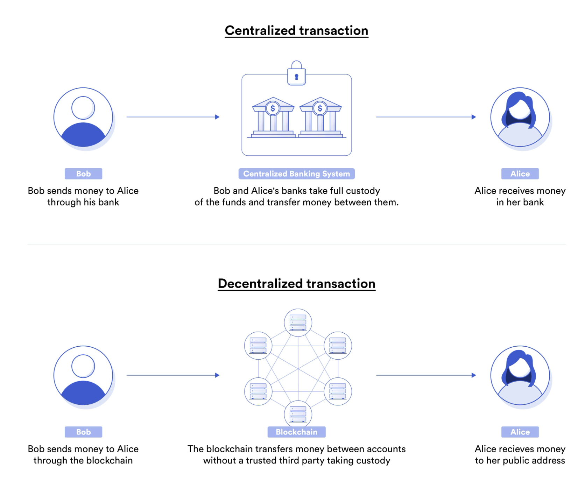
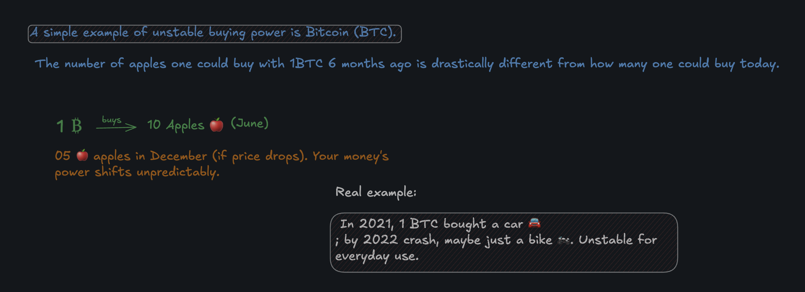
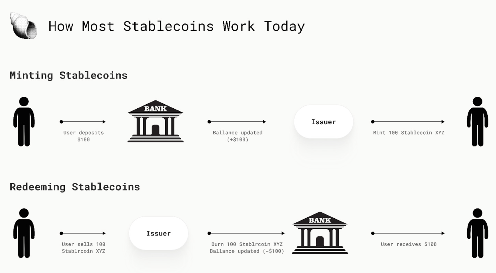
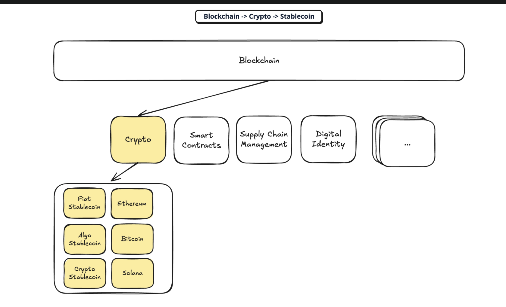
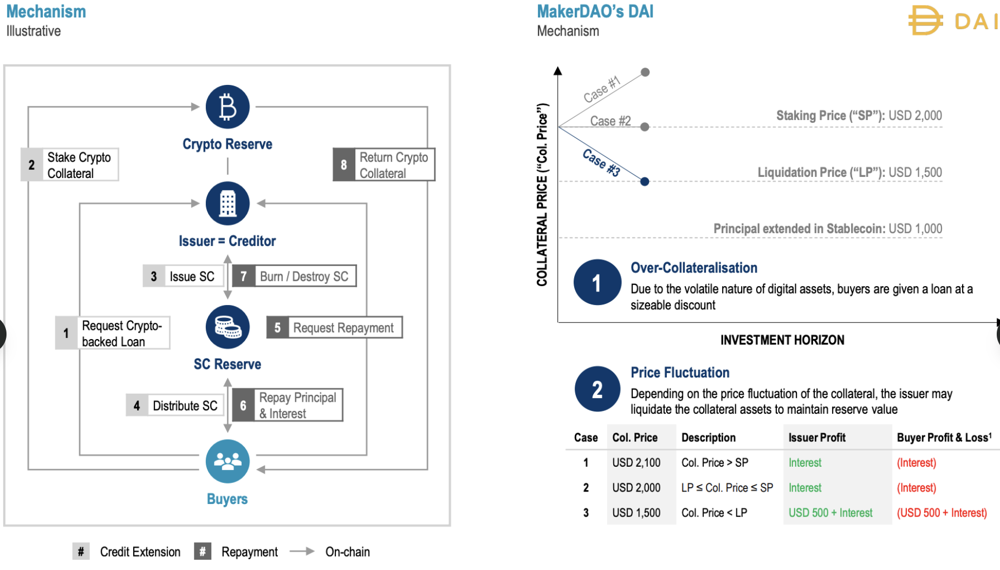

# DeFi-StableCoin ☯🌐💰

 Stablecoins have become one of the most talked about topics in the cryptocurrency and blockchain space.

DeFi stablecoins are cryptocurrencies built on decentralized finance protocols that aim to hold a `steady value`, typically pegged 1:1 to assets like the US dollar.

They enable programmable money for `lending`, `borrowing`, and `trading` without intermediaries, bridging traditional finance stability with blockchain efficiency while powering most `DeFi liquidity`. 

## 1. What are `Stablecoins` ☯☯?

     A stablecoin is a non‑volatile crypto asset whose buying power stays relatively stable over time.

 `example`:    

 

 `stablecoin` = crypto asset engineered so that its purchasing power doesn’t swing like BTC/ETH.

  

 ## 2. Why do we care?

       Money is important😁.

 Money has `3 classic functions`:
​

 `Store of value` – you can save it and expect similar purchasing power later (assuming reasonable inflation).

`Unit of account` – you can price and compare goods/services in that unit (e.g., “this NFT is 100 DAI”).

 `Medium of exchange` – everyone accepts it in trade, avoiding barter’s “double coincidence of wants.”

 In `Web3`:

BTC/ETH can be used as store of value and medium of exchange, but they are bad units of account because their value is too volatile.

Stablecoins give Web3 a usable “money” that can fulfill all three roles on‑chain.

## `03.Categories and properties`?

 Stablecoins aren't just "fiat, crypto, or algo"

 —they fit better on three key axes. Here's a simple breakdown with visuals.
 

## 1. `Relative Stability`: 
     Pegged vs Floating
 `Pegged/Anchored`: 
 Locks to a fixed value like $1 USD via collateral or arbitrage (e.g., USDC, USDT, DAI).

 `Floating`: 
 Aims for steady buying power, not exact $1 peg; drifts freely (e.g., RAI, ETH-backed).

## 2. `Stability Method`: 
 `Governed` vs `Algorithmic`
 Governed: Humans/DAOs control minting/burning
 (e.g., USDC by Circle, USDT by Tether).

 Algorithmic: Smart contracts auto-mint/burn—no human calls 
(e.g., pure DAI/FRAX rules, RAI).

## 3. `Collateral Type`: `Exogenous vs Endogenous`

 `Exogenous`: Outside assets back it—if stablecoin fails, collateral survives 
  (e.g., USDC's USD, DAI's ETH).

 `Endogenous`: Protocol creates its own backing—if it fails, everything crashes 
(e.g., UST/LUNA death spiral).

## 04. Designs of `top stablecoins` ?

 `DAI` (Pegged, Algorithmic, Exogenous)

 Over-collateralized with ETH (etc.) in Maker vaults;
 mint less DAI than collateral value. Pay stability fees; liquidations if undercollateralized.

 `USDC` (Pegged, Governed, Exogenous)
Fully backed by off-chain reserves (cash/treasuries) via Circle; 1:1 USD redeemable, with attestations.

 `UST/LUNA` (Terra) (Pegged, Algorithmic, Endogenous)
 ### Swap 1 UST for 1 USD-worth of LUNA; failed in death spiral (LUNA hyperinflation wiped $40B) when peg broke.

 `FRAX` (Pegged, Algorithmic, Hybrid)
 Mix of collateral and algorithms for capital efficiency; balances exogenous safety with endogenous risks.

 `RAI` (Floating, Algorithmic, Exogenous)
 ETH-collateralized (Maker fork) free-floating price stabilized via redemption price adjustments (positive/negative rates). Non-USD peg, minimal governance.

## 5. `What stablecoins really do`??

 Stablecoins act like digital cash on blockchain:

 they hold steady value (store of value), price things clearly (unit of account), and let you trade easily (medium of exchange). No "best" one—centralized like USDT/USDC are simple and liquid but company-controlled; decentralized like DAI use smart contracts for freedom but can wobble in value.
    Everyday folks use them to avoid crypto ups/downs. Big traders "mint" by locking ETH, borrow stablecoins, swap for more ETH—to supercharge wins (or losses). 

 `Centralized`: Easy, trusted companies back with dollars. 
 `Decentralized`: Code-run, no boss, but riskier peg.

### still in process.....

